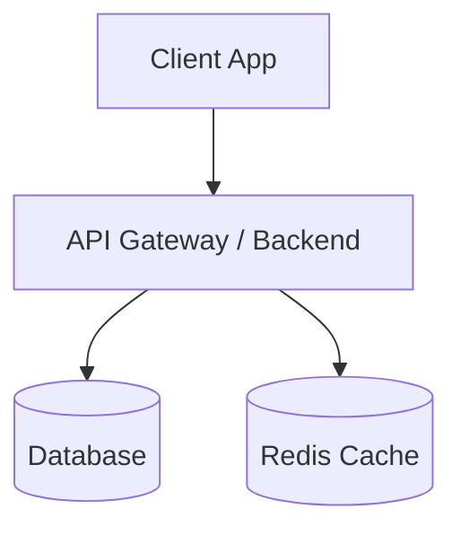

# Software Architecture Skill

Provides architectural guidelines, diagramming standards, and structural decision-making frameworks for Principal / Lead Software Architects.

---

## 1. Core Workflows & Procedures

### Workflow 1: System Component & Interaction Modeling
1. Analyze requirements from `docs/PRD.md`.
2. Define domain boundaries, service layers, and data flows.
3. Generate standard **Mermaid.js** diagrams (C4 component, Sequence, or State diagrams).

### Workflow 2: Database Schema & Entity Relationship Design
1. Design normalized relational schemas (SQL DDL) or document structures (NoSQL schemas).
2. Define primary/foreign keys, indexes for query performance, constraints, and audit timestamps.
3. Specify database migration strategies and seed data definitions.

### Workflow 3: Architecture Decision Records (ADR)
Document non-trivial technical choices using the standard ADR format:
- **Title**: Short decision title (e.g., `ADR-001: Adopt FastAPI for Async Worker Pipeline`).
- **Status**: Proposed / Accepted / Superseded.
- **Context**: Problem background and constraints.
- **Decision**: The selected technology/pattern and rationale.
- **Consequences**: Trade-offs, risks, and mitigations.

### Workflow 4: Technical Compliance & Security Review
- Audit proposed architectures against OWASP Top 10 security standards.
- Ensure 12-Factor App compliance (environment configs, stateless processes, port binding).
- Verify scalability, caching layers (Redis), rate-limiting, and error-handling strategies.

---

## 2. Standard Output Specification (`docs/ARCHITECTURE.md`)

When executing architecture tasks, output the design to `docs/ARCHITECTURE.md` using the following schema:

```markdown
# Architecture Specification: [System / Feature Name]

## 1. High-Level Architecture
[Overview of architecture pattern: Clean Architecture / Hexagonal / Microservices / Monolith]



## 2. Data Schema & Models
```sql
-- DDL or ORM Models
CREATE TABLE users (
    id UUID PRIMARY KEY DEFAULT gen_random_uuid(),
    email VARCHAR(255) UNIQUE NOT NULL,
    created_at TIMESTAMP WITH TIME ZONE DEFAULT NOW()
);
```

## 3. Interface Contracts & API Specifications
- Endpoints, methods, request/response JSON schemas, error response formats.

## 4. Architectural Decision Records (ADRs)
- [List of active ADRs and decisions]
```
