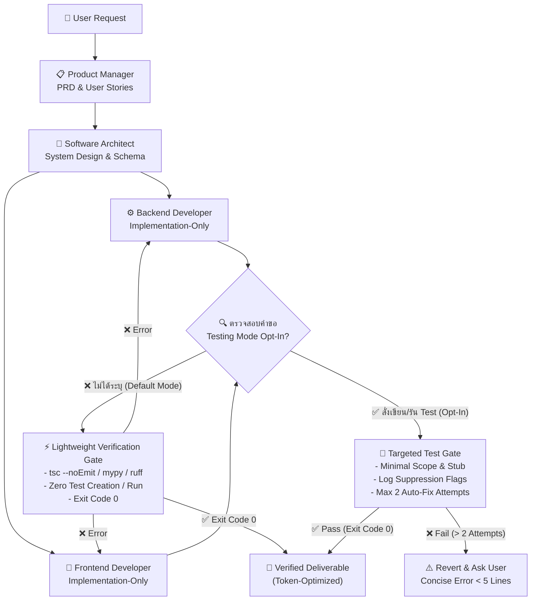

# 🤖 Software Development Team Agents (Agent Harness Template)

แม่แบบ (Template) สำหรับสร้างและจำลองทีมพัฒนาซอฟต์แวร์ด้วย AI Agents (Agent Harness) สำหรับระบบ `agy` CLI และ Multi-Agent Frameworks อื่นๆ พร้อม **ระบบป้องกันและตรวจจับอาการหลอน (Anti-Hallucination & Verification System)** และ **นโยบายประหยัด Token ขั้นสูง (Strict Token Optimization Directive)** ในตัว

โปรเจกต์นี้ถูกออกแบบมาเพื่อเป็น **โครงสร้างตั้งต้น (Starter Template)** ให้คุณสามารถนำไปปรับแต่ง ขยายขีดความสามารถ และกำหนดบทบาท (Roles), ทักษะ (Skills), รวมทั้งพฤติกรรมการทำงานของ AI Agent ให้สอดคล้องกับรูปแบบการทำงานของทีมได้อย่างมีประสิทธิภาพสูงและประหยัด Token สูงสุด

---

## 📌 จุดเด่น (Key Features)

- **Role-Based Architecture:** แยกหน้าที่และบทบาทของทีมพัฒนาซอฟต์แวร์อย่างชัดเจนตามมาตรฐาน SDLC (PM, Architect, Backend, Frontend, QA)
- **⚡ Strict Token Optimization & Test Control:** นโยบายประหยัด Token ขั้นเด็ดขาด (Zero-Test Policy by Default) โฟกัสการสร้างโค้ดและสัญญา (Contract) 100% ป้องกันการสร้างและรันชุดทดสอบโดยไม่จำเป็น
- **🛡️ Built-in Anti-Hallucination Protocols:** กฎเหล็กความจริงเชิงประจักษ์ (Ground Truth) ป้องกันการสร้างโค้ดหลอน อ้างอิงไฟล์ปลอม หรือสร้าง Dependency ที่ไม่มีอยู่จริง
- **🔬 Lightweight Verification Alternative:** ใช้ Fast Static Analysis (`tsc --noEmit`, `mypy --quick`, `ruff check`) เป็นเกณฑ์ตัดสินความถูกต้องพื้นฐานแทนการรัน Test Runner ที่กิน Token มหาศาล
- **🎯 Opt-In Testing Guardrails:** รองรับการเขียนและรัน Unit Test เฉพาะเมื่อผู้ใช้สั่งการอย่างชัดเจน (Explicit Trigger) พร้อมระบบจำกัดขอบเขต, ตัดทอน Log และจำกัดลูปแก้โค้ดไม่เกิน 2 ครั้ง (Max 2 Attempts)
- **Standardized Skills & Profiles:** ทักษะถูกจัดโครงสร้างตามมาตรฐาน Antigravity (`.agents/skills/<name>/SKILL.md`) รองรับ Progressive Disclosure ของ `agy` CLI

---

## ⚡ นโยบายประหยัด Token และควบคุมการทดสอบ (Strict Token Optimization Directive)

เพื่อป้องกันปัญหา Agent ใช้ Token สิ้นเปลืองจากการสร้างไฟล์ Test ขนาดยักษ์, อ่าน Test Context ที่ไม่จำเป็น, หรือติด Infinite Loop ในการรัน Test Runner ระบบ Harness จึงกำหนดกฎเกณฑ์ดังนี้:

### 1. พฤติกรรมเริ่มต้น: นโยบายงด Test โดยเด็ดขาด (Strict Zero-Test / Implementation-Only Mode)
โดยค่าเริ่มต้น เอเจนต์ทุกตัวจะทำงานในโหมด **Implementation-Only**:
- **DO NOT WRITE TESTS:** ห้ามสร้าง, แก้ไข, หรือแตะต้องไฟล์ทดสอบ (`*.test.*`, `*.spec.*`, `tests/`, `__tests__/`) โดยพลการ
- **DO NOT EXECUTE TESTS:** ห้ามสั่งรัน Test Runner (`pytest`, `vitest`, `jest`, `npm test`, `cargo test` ฯลฯ) โดยอัตโนมัติ
- **DO NOT READ TEST CONTEXT:** ห้ามโหลดหรืออ่านไฟล์ทดสอบเดิมเข้าสู่ Context เว้นแต่จะเกิดข้อผิดพลาดในการ Compile/Import โค้ดจริง
- **ONLY CODE & CONTRACT:** มุ่งเน้น 100% ของการประมวลผลไปที่ Production Code, Signatures, Schemas และ Interfaces

### 2. เงื่อนไขการเปิดโหมดทดสอบ (Explicit Opt-In Trigger)
ระบบจะเปลี่ยนเข้าสู่ **Testing Mode** ก็ต่อเมื่อผู้ใช้ระบุคำสั่งไว้อย่างชัดเจนใน Prompt เช่น:
`"write test"`, `"unit test"`, `"test this"`, `"run tests"`, หรือ `"generate test suite"`

### 3. มาตรการควบคุมเมื่อเปิดโหมดทดสอบ (Testing Guardrails)
เมื่อผู้ใช้สั่งให้ทดสอบ ระบบจะบังคับใช้กฎประหยัด Token ดังต่อไปนี้:
- **Minimal Context & Scope:** ทดสอบเฉพาะฟังก์ชันหรือโมดูลที่สั่งเท่านั้น ห้ามทำ Full-Suite Coverage และห้ามอ่านไฟล์ที่ไม่เกี่ยวข้องเพื่อทำ Mock ให้ใช้ Minimal Stub แทน
- **Execution & Log Suppression:** กำหนดเป้าหมายเฉพาะไฟล์/ฟังก์ชันเดี่ยว และส่ง Flag ย่อ Log เสมอ:
  - **Python:** `pytest <path> -q --tb=short --maxfail=1`
  - **Node/TS:** `npx vitest run <path> --reporter=compact` หรือ `npm test -- <path> --bail`
  - **Go:** `go test -v -run <TestName> <pkg>`
  - **Rust:** `cargo test <test_name> -- --nocapture`
- **Strict Auto-Fix Loop Limit (สูงสุด 2 ครั้ง):**
  - **รอบที่ 1:** อ่านข้อความ Error สั้นๆ $\rightarrow$ แก้ไขโค้ดแบบเจาะจง
  - **รอบที่ 2:** รันซ้ำ 1 ครั้ง หากยังไม่ผ่าน **ต้องหยุดทำงานทันที (STOP IMMEDIATELY)**
  - คืนค่าโค้ด (Revert), สรุปรายงาน Error สั้นไม่เกิน 5 บรรทัด แล้วสอบถามแนวทางจากผู้ใช้ ห้ามวนลูปเกิน 2 ครั้งโดยเด็ดขาด

### 4. วิธีการตรวจสอบแบบประหยัด Token (Lightweight Verification Alternative)
ใช้เครื่องมือ Static Analysis และ Linter ที่รวดเร็วและใช้ Token ต่ำในการตรวจความถูกต้องแทน Unit Test:
- ตรวจสอบประเภทข้อมูลและไวยากรณ์ด้วย `tsc --noEmit`, `mypy --quick`, `ruff check`
- เมื่องานผ่านการตรวจสอบ Static Analysis ด้วย Exit Code `0` ถือว่าผ่านเกณฑ์ส่งมอบงานทันที

---

## 🛡️ ระบบป้องกันอาการหลอน (Anti-Hallucination Framework)

| กฎเหล็ก (Iron Law) | หลักการทำงาน | วิธีตรวจสอบเชิงประจักษ์ (Ground Truth) |
| :--- | :--- | :--- |
| **1. Deterministic Verification** | ห้ามเชื่อคำกล่าวอ้างว่า "เสร็จแล้ว" หรือ "ผ่านแล้ว" ของ Agent | ตรวจสอบ Exit code `0` ผ่าน Static Check / Linter (หรือ Unit Test เมื่อเปิดโหมด Opt-In) |
| **2. Codebase Grounding First** | ห้ามคิดชื่อฟังก์ชัน/ไฟล์/Schema เองโดยไม่อ่านโค้ดจริง | บังคับใช้ `grep_search` / `find_by_name` / `view_file` ตรวจสอบก่อนเสมอ |
| **3. Dependency Grounding** | ห้าม Import library ภายนอกที่ไม่มีอยู่จริง | ตรวจสอบไฟล์ `package.json` หรือ `requirements.txt` ก่อนใช้งาน |
| **4. Empirical Evidence Required** | ทุกข้อสรุปต้องมีหลักฐานรองรับ | ต้องระบุ File Path, บรรทัด หรือ Log Terminal จริง |
| **5. Token Optimization Directive** | ห้ามสร้างขยะ Token จากการรัน/สร้าง Test โดยไม่จำเป็น | Zero-Test by Default, Opt-In Testing, และจำกัดลูปแก้โค้ดไม่เกิน 2 ครั้ง |

---

## 👥 บทบาทภายในทีม (Team Roles)

โครงสร้างทีมประกอบด้วย 5 บทบาทหลัก:

| บทบาท (Role) | รหัส Agent | หน้าที่หลัก | อ้างอิง Skills |
| :--- | :--- | :--- | :--- |
| **📋 Product Manager (PM)** | `pm_agent` | วิเคราะห์ความต้องการ, ร่าง PRD, จัดทำ User Stories และ Acceptance Criteria | [product-management](.agents/skills/product-management/SKILL.md) |
| **📐 Software Architect** | `architect_agent` | ออกแบบโครงสร้างระบบ, วาง Schema ฐานข้อมูล, เลือก Design Patterns, เขียน ADR | [software-architecture](.agents/skills/software-architecture/SKILL.md) |
| **⚙️ Backend Developer** | `backend_agent` | พัฒนา API, เขียน Business Logic หลังบ้าน, ยืนยันความถูกต้องผ่าน Schema Models และ Static Check (โหมด Implementation-Only เป็นหลัก) | [backend-development](.agents/skills/backend-development/SKILL.md) |
| **🎨 Frontend Developer** | `frontend_agent` | พัฒนาหน้าจอ UI/UX, จัดการ State, ตรวจสอบไวยากรณ์ Type และ Visual States (โหมด Implementation-Only เป็นหลัก) | [frontend-development](.agents/skills/frontend-development/SKILL.md) |
| **🧪 QA Engineer (Gatekeeper)** | `qa_agent` | ผู้เฝ้าประตูความจริงและควบคุมการใช้ Token ตรวจสอบโค้ดด้วย Static Check (Exit code 0) โดยค่าเริ่มต้น และรัน Unit Test เฉพาะเมื่อผู้ใช้ระบุ | [qa-automation](.agents/skills/qa-automation/SKILL.md), [anti-hallucination](.agents/skills/anti-hallucination-guardian/SKILL.md) |

---

## 🔄 ขั้นตอนการทำงานร่วมกันพร้อม Token-Optimized Verification Gate

---

## 📁 โครงสร้างโปรเจกต์ (Directory Structure)

- `AGENTS.md` : ข้อกำหนดการกำกับดูแลเอเจนต์ (Governance), กฎเหล็ก Anti-Hallucination และ Strict Token Optimization
- `docs/` : เอกสารข้อกำหนดและนโยบาย
  - `docs/policies/unittest-policy.md` : นโยบายควบคุม Unit Test และการประหยัด Token ฉบับสมบูรณ์
- `.agents/` : โครงสร้างความสามารถและทักษะของ Agent ตามมาตรฐาน Antigravity
  - `.agents/skills/anti-hallucination-guardian/SKILL.md` : ระบบตรวจสอบความจริงเชิงประจักษ์และการควบคุม Token
  - `.agents/skills/qa-automation/SKILL.md` : กระบวนการ QA Gatekeeper, Lightweight Verification และ Guardrails เมื่อเข้า Testing Mode
  - `.agents/skills/backend-development/SKILL.md` : ทักษะงานฝั่งเซิร์ฟเวอร์แบบเน้น Implementation และ Schema Validation
  - `.agents/skills/frontend-development/SKILL.md` : ทักษะงานฝั่งหน้าบ้านและการตรวจสอบ TypeScript
  - `.agents/skills/product-management/SKILL.md` : ทักษะด้านการจัดการผลิตภัณฑ์ (PRD, Stories, Acceptance Criteria)
  - `.agents/skills/software-architecture/SKILL.md` : ทักษะด้านสถาปัตยกรรม (Schema, Diagrams, ADRs)
- `README.md` : เอกสารแนะนำโปรเจกต์ โครงสร้างทีม และคู่มือการใช้งาน

---

## 📄 ลิขสิทธิ์และการนำไปใช้ (License)

โปรเจกต์นี้เปิดให้ใช้งานและดัดแปลงได้อย่างอิสระ (Open Template) เพื่อนำไปประยุกต์ใช้ในการพัฒนาซอฟต์แวร์ทั้งส่วนบุคคลและเชิงพาณิชย์
