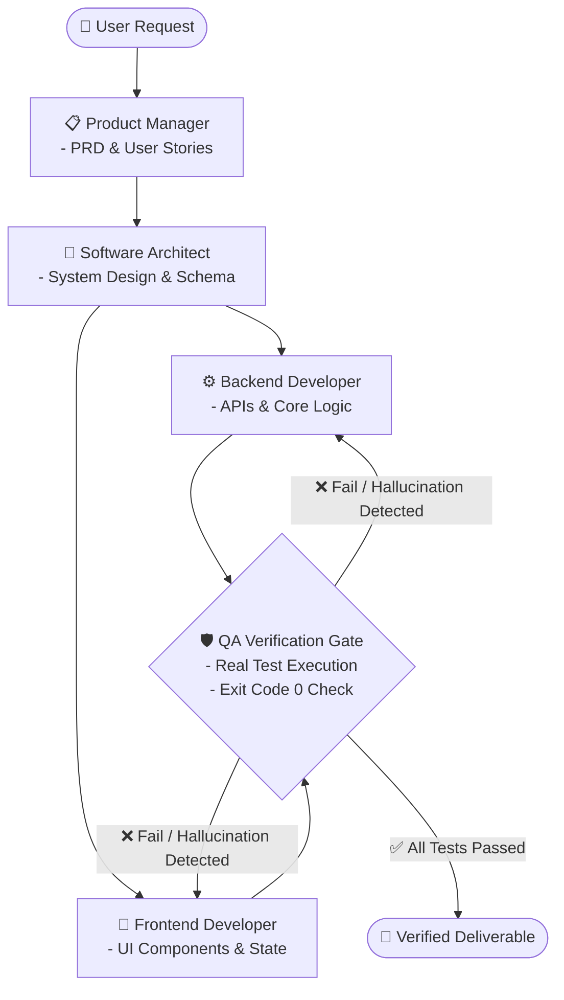

# 🤖 Software Development Team Agents (Agent Harness Template)

แม่แบบ (Template) สำหรับสร้างและจำลองทีมพัฒนาซอฟต์แวร์ด้วย AI Agents (Agent Harness) สำหรับระบบ `agy` CLI และ Multi-Agent Frameworks อื่นๆ พร้อม **ระบบป้องกันและตรวจจับอาการหลอน (Anti-Hallucination & Verification System)** ในตัว

โปรเจกต์นี้ถูกออกแบบมาเพื่อเป็น **โครงสร้างตั้งต้น (Starter Template)** ให้คุณสามารถนำไปปรับแต่ง ขยายขีดความสามารถ และกำหนดบทบาท (Roles), ทักษะ (Skills), รวมทั้งพฤติกรรมการทำงานของ AI Agent ให้สอดคล้องกับรูปแบบการทำงานหรือโปรเจกต์ของตนเองได้อย่างอิสระและมีความแม่นยำสูง

---

## 📌 จุดเด่น (Key Features)

- **Role-Based Architecture:** แยกหน้าที่และบทบาทของทีมพัฒนาซอฟต์แวร์อย่างชัดเจนตามมาตรฐาน SDLC (Software Development Life Cycle)
- **🛡️ Built-in Anti-Hallucination Protocols:** กฎเหล็ก 4 ข้อ (The 4 Golden Rules) และระบบตรวจสอบ Ground Truth ป้องกันการสร้างโค้ดหลอน อ้างอิงไฟล์ปลอม หรือสร้าง Dependency ที่ไม่มีอยู่จริง
- **Standardized Skills & Profiles:** ทักษะถูกจัดโครงสร้างตามมาตรฐาน Antigravity (`skills/<name>/SKILL.md`) รองรับ Progressive Disclosure และ Discovery ของ `agy` CLI
- **Independent QA Verification Oracle:** ให้ QA Agent ทำหน้าที่เป็น Gatekeeper ตรวจสอบ Exit Code (0), Type Checking, และ Test Assertions จริงก่อนส่งมอบงาน
- **Extensible & Adaptable:** รองรับการเพิ่มบทบาทใหม่ และปรับแต่ง Tech Stack ได้อย่างอิสระ

---

## 🛡️ ระบบป้องกันอาการหลอน (Anti-Hallucination Framework)

| กฎเหล็ก (Iron Law) | หลักการทำงาน | วิธีตรวจสอบเชิงประจักษ์ (Ground Truth) |
| :--- | :--- | :--- |
| **1. Deterministic Verification** | ห้ามเชื่อคำกล่าวอ้างว่า "เสร็จแล้ว" หรือ "ผ่านแล้ว" ของ Agent | ต้องรัน Unit/E2E Test จริงและได้ Exit code `0` |
| **2. Codebase Grounding First** | ห้ามคิดชื่อฟังก์ชัน/ไฟล์/Schema เองโดยไม่อ่านโค้ดจริง | บังคับใช้ `grep_search` / `find_by_name` / `view_file` ตรวจสอบก่อนเสมอ |
| **3. Dependency Grounding** | ห้าม Import library ภายนอกที่ไม่มีอยู่จริง | ตรวจสอบไฟล์ `package.json` หรือ `requirements.txt` ก่อนใช้งาน |
| **4. Empirical Evidence Required** | ทุกข้อสรุปต้องมีหลักฐานรองรับ | ต้องระบุ File Path, บรรทัด หรือ Log Terminal จริง |

---

## 👥 บทบาทภายในทีม (Team Roles)

โครงสร้างทีมเริ่มต้นประกอบด้วย 5 บทบาทหลัก:

| บทบาท (Role) | รหัส Agent | หน้าที่หลัก | อ้างอิง Skills |
| :--- | :--- | :--- | :--- |
| **📋 Product Manager (PM)** | `pm_agent` | วิเคราะห์ความต้องการ, ร่าง PRD, จัดทำ User Stories และ Acceptance Criteria | [product-management](.agents/skills/product-management/SKILL.md) |
| **📐 Software Architect** | `architect_agent` | ออกแบบโครงสร้างระบบ, วาง Schema ฐานข้อมูล, เลือก Design Patterns, เขียน ADR | [software-architecture](.agents/skills/software-architecture/SKILL.md) |
| **⚙️ Backend Developer** | `backend_agent` | พัฒนา API, เขียน Business Logic หลังบ้าน, เชื่อมต่อบริการภายนอก และ Optimize Queries | [backend-development](.agents/skills/backend-development/SKILL.md) |
| **🎨 Frontend Developer** | `frontend_agent` | พัฒนาหน้าจอ UI/UX, จัดการ State ของ Client, ทำ Mock API สำหรับทดสอบ | [frontend-development](.agents/skills/frontend-development/SKILL.md) |
| **🧪 QA Engineer (Gatekeeper)** | `qa_agent` | ตรวจสอบความถูกต้อง (Truth Oracle), ออกแบบชุดทดสอบ Unit/E2E, Fuzzing | [qa-automation](.agents/skills/qa-automation/SKILL.md), [anti-hallucination](.agents/skills/anti-hallucination-guardian/SKILL.md) |

---

## 🔄 ตัวอย่างขั้นตอนการทำงานร่วมกันพร้อม Verification Gate



---

## 📁 โครงสร้างโปรเจกต์ (Directory Structure)

```text
TeamAgents/
├── AGENTS.md                              # Root Rules & Anti-Hallucination Governance
├── .agents/
│   └── skills/                            # ทักษะตามมาตรฐาน Antigravity Skill Specification
│       ├── anti-hallucination-guardian/   # [NEW] ระบบตรวจสอบและป้องกันอาการหลอน
│       │   └── SKILL.md
│       ├── product-management/            # ทักษะด้านการจัดการผลิตภัณฑ์ (PRD, Stories, Backlog)
│       │   └── SKILL.md
│       ├── software-architecture/         # ทักษะด้านสถาปัตยกรรม (Schema, Diagrams, ADRs)
│       │   └── SKILL.md
│       ├── backend-development/           # ทักษะด้านฝั่งเซิร์ฟเวอร์ (API Scaffolding, Query Optimization)
│       │   └── SKILL.md
│       ├── frontend-development/          # ทักษะด้านหน้าบ้าน (UI Components, State Management, Mock API)
│       │   └── SKILL.md
│       └── qa-automation/                 # ทักษะด้านการประกันคุณภาพ และ Truth Verification Gate
│           └── SKILL.md
└── README.md                              # คำอธิบายโปรเจกต์และการใช้งาน
```

---

## 📄 ลิขสิทธิ์และการนำไปใช้ (License)

โปรเจกต์นี้เปิดให้ใช้งานและดัดแปลงได้อย่างอิสระ (Open Template) เพื่อนำไปประยุกต์ใช้ในการพัฒนาซอฟต์แวร์ทั้งส่วนบุคคลและเชิงพาณิชย์
