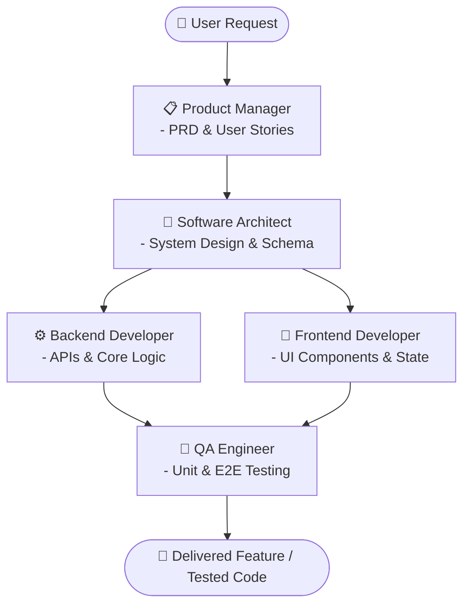

# 🤖 Software Development Team Agents (Agent Harness Template)

แม่แบบ (Template) สำหรับสร้างและจำลองทีมพัฒนาซอฟต์แวร์ด้วย AI Agents (Agent Harness) สำหรับระบบ `agy` CLI และ Multi-Agent Frameworks อื่นๆ

โปรเจกต์นี้ถูกออกแบบมาเพื่อเป็น **โครงสร้างตั้งต้น (Starter Template)** ให้คุณสามารถนำไปปรับแต่ง ขยายขีดความสามารถ และกำหนดบทบาท (Roles), ทักษะ (Skills), รวมทั้งพฤติกรรมการทำงานของ AI Agent ให้สอดคล้องกับรูปแบบการทำงานหรือโปรเจกต์ของตนเองได้อย่างอิสระ

---

## 📌 จุดเด่น (Key Features)

- **Role-Based Architecture:** แยกหน้าที่และบทบาทของทีมพัฒนาซอฟต์แวร์อย่างชัดเจนตามมาตรฐาน SDLC (Software Development Life Cycle)
- **Modular Skills & Profiles:** แยกคำสั่ง ทักษะ (`skills/`) และ System Prompt (`AGENTS.md`) ให้แก้ไขและเพิ่มเติมได้ง่าย
- **Extensible & Adaptable:** รองรับการเพิ่มบทบาทใหม่ เช่น DevOps Engineer, Security Auditor, UX Designer หรือปรับแต่งระบบเดิมให้ตรงกับ Tech Stack ที่ต้องการ
- **Ready for Multi-Agent Orchestration:** ใช้งานร่วมกับ `agy` CLI หรือส่งต่อไปยัง AI Agent Frameworks ต่างๆ ได้ทันที

---

## 👥 บทบาทภายในทีม (Team Roles)

โครงสร้างทีมเริ่มต้นประกอบด้วย 5 บทบาทหลัก:

| บทบาท (Role) | รหัส Agent | หน้าที่หลัก | อ้างอิง Skills |
| :--- | :--- | :--- | :--- |
| **📋 Product Manager (PM)** | `pm_agent` | วิเคราะห์ความต้องการ, ร่าง PRD, จัดทำ User Stories และ Acceptance Criteria | [product.md](.agents/skills/product.md) |
| **📐 Software Architect** | `architect_agent` | ออกแบบโครงสร้างระบบ, วาง Schema ฐานข้อมูล, เลือก Design Patterns และตรวจสอบ Compliance | [architecture.md](.agents/skills/architecture.md) |
| **⚙️ Backend Developer** | `backend_agent` | พัฒนา API, เขียน Business Logic หลังบ้าน, เชื่อมต่อบริการภายนอก และ Optimize Queries | [backend.md](.agents/skills/backend.md) |
| **🎨 Frontend Developer** | `frontend_agent` | พัฒนาหน้าจอ UI/UX, จัดการ State ของ Client, ทำ Mock API สำหรับทดสอบ | [frontend.md](.agents/skills/frontend.md) |
| **🧪 QA Engineer** | `qa_agent` | ออกแบบชุดทดสอบ Unit/Integration/E2E, จำลองสถานการณ์ และหา Edge cases/Fuzzing | [qa.md](.agents/skills/qa.md) |

---

## 🔄 ตัวอย่างขั้นตอนการทำงานร่วมกัน (Collaboration Workflow)



---

## 📁 โครงสร้างโปรเจกต์ (Directory Structure)

```text
TeamAgents/
├── .agents/
│   ├── AGENTS.md          # เอกสารกำหนด Agent Profiles, System Prompts และ Configuration
│   └── skills/            # โฟลเดอร์รวมรายการความสามารถ/ทักษะเฉพาะทางของแต่ละ Role
│       ├── product.md         # ทักษะด้านการจัดการผลิตภัณฑ์ (PRD, Stories, Backlog)
│       ├── architecture.md    # ทักษะด้านสถาปัตยกรรม (Schema, Diagrams, Compliance)
│       ├── backend.md         # ทักษะด้านฝั่งเซิร์ฟเวอร์ (API Scaffolding, Query Optimization)
│       ├── frontend.md        # ทักษะด้านหน้าบ้าน (UI Components, State Management)
│       └── qa.md              # ทักษะด้านการประกันคุณภาพ (Unit Tests, E2E, Fuzzing)
└── README.md              # คำอธิบายโปรเจกต์และการใช้งาน
```

---

## 🛠️ วิธีนำไปปรับใช้และต่อยอด (Customization Guide)

คุณสามารถปรับแต่งโปรเจกต์นี้ให้เข้ากับงานของคุณได้ตามขั้นตอนต่อไปนี้:

### 1. ปรับแต่งหรือเพิ่มบทบาทใน `.agents/AGENTS.md`
คุณสามารถเปลี่ยน System Prompt หรือเพิ่ม Agent ใหม่เข้าไปได้ เช่น เพิ่ม `DevOps Engineer`:

```yaml
### 🚀 DevOps Engineer
* **Role:** CI/CD & Infrastructure
* **Profile:** Automation-driven, reliability-focused.
* **Skills Reference:** `skills/devops.md`
* **Configuration:**
  ```yaml
  name: devops_agent
  system_prompt: "You are a Senior DevOps Engineer. Write Dockerfiles, Kubernetes manifests, and CI/CD pipelines."
  ```
```

### 2. เพิ่มเติมทักษะเฉพาะใน `.agents/skills/`
สร้างไฟล์ Markdown ภายใต้ `.agents/skills/` เพื่อระบุ Tools หรือคำสั่งเฉพาะทางที่ Agent นั้นๆ สามารถเรียกใช้ได้ เช่น การสร้าง [`devops.md`](.agents/skills/devops.md):

```markdown
# DevOps Skills
* **`generate_dockerfile`**: สร้าง Containerfile/Dockerfile ที่ปลอดภัยและมีประสิทธิภาพ
* **`create_ci_pipeline`**: สร้าง GitHub Actions หรือ GitLab CI workflow
```

### 3. ปรับเปลี่ยนให้ตรงกับ Tech Stack ของโปรเจกต์
แก้ไข Prompt ใน [`.agents/AGENTS.md`](.agents/AGENTS.md) เพื่อระบุภาษาหรือเฟรมเวิร์กที่ต้องการ เช่น:
- Backend: *Node.js (NestJS), Go, Python (FastAPI)*
- Frontend: *React, Vue.js, TailwindCSS*
- Database: *PostgreSQL, MongoDB*
- Testing: *Jest, PyTest, Playwright*

---

## 📄 ลิขสิทธิ์และการนำไปใช้ (License)

โปรเจกต์นี้เปิดให้ใช้งานและดัดแปลงได้อย่างอิสระ (Open Template) เพื่อนำไปประยุกต์ใช้ในการพัฒนาซอฟต์แวร์ทั้งส่วนบุคคลและเชิงพาณิชย์
